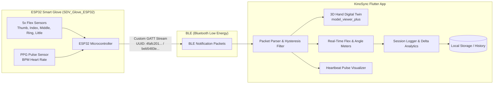

# 🖐️ KinoSync: Cyber-Physical Smart Glove Telemetry & 3D Digital Twin Platform

[](https://flutter.dev)
[](https://www.espressif.com/)
[](https://www.bluetooth.com/)
[](LICENSE)

**KinoSync** is a real-time Cyber-Physical System (CPS) and teleoperation dashboard built with Flutter. It connects wirelessly over **Bluetooth Low Energy (BLE)** to a smart sensor glove (**SDV Glove**) powered by an **ESP32 microcontroller**. 

The app visualizes 5-finger articulation in real time via an interactive **3D Digital Twin** model (`Hand_Animation_Final.glb`), calculates continuous joint flexion degrees ($0^\circ$ to $90^\circ$), monitors heart rate (BPM), and logs physical therapy / rehabilitation sessions with automated comparative delta analysis.

---

## 📸 Key Features

- **🦾 Real-Time 3D Digital Twin**: Renders an interactive 3D hand (`model_viewer_plus`) with skeletal animations (`Thumb_Flex`, `Index_Flex`, `Middle_Flex`, `Ring_Flex`, `Little_Flex`) mapped to live glove movement.
- **⚡ Dominant-Finger Detection with Hysteresis**: Uses a +12% threshold hysteresis filter to eliminate animation jitter and accurately track primary finger actions.
- **🌈 Dynamic Reactive Glow**: Background ambient lighting morphs in real time to match the active finger's unique color signature.
- **📊 Continuous Angle & Flex Telemetry**: Translates raw flex sensor percentages into biomechanical joint flexion angles:
  $$\theta = \text{flexPercent} \times 0.9 \quad (0\% \to 0^\circ, \ 100\% \to 90^\circ)$$
- **❤️ Vital Signs Telemetry (Pulse/BPM)**: Integrated photoplethysmography (PPG) pulse sensor visualizer with heartbeat animation synchronized to patient pulse rate.
- **📝 Clinical / Rehabilitation Session Logger**: Record and store training attempts locally (up to 50 sessions) with peak flexion, duration, timestamp, and per-finger progress ($\Delta\%$) tracking.

---

## 🏗️ System Architecture



---

## 📡 Wireless Protocol (BLE GATT)

The application pairs automatically with the ESP32 glove:

- **Target Device Name:** `SDV_Glove_ESP32`
- **Service UUID:** `4fafc201-1fb5-459e-8fcc-c5c9c331914b`
- **Characteristic UUID:** `beb5483e-36e1-4688-b7f5-ea07361b26a8`
- **Data Payload Format:** Comma or pipe-delimited ASCII string:
  ```
  Thumb, Index, Middle, Ring, Little [, BPM]
  Example: 45.2, 80.1, 10.0, 5.5, 0.0, 72
  ```

---

## 🎨 Color Coding

| Finger | Accent Color | Hex | Default Animation |
| :--- | :--- | :--- | :--- |
| **Thumb** | Neon Cyan | `#00FFCC` | `Thumb_Flex` |
| **Index** | Cyber Purple | `#7B2FFF` | `Index_Flex` |
| **Middle** | Coral Orange | `#FF6B35` | `Middle_Flex.001` |
| **Ring** | Gold | `#FFD700` | `Ring_Flex` |
| **Little** | Hot Pink | `#FF2D78` | `Little_Flex` |

---

## 🚀 Getting Started

### Prerequisites

- [Flutter SDK](https://docs.flutter.dev/get-started/install) (`>= 3.0.0`)
- Android Studio / Xcode (with iOS deployment tools) or Chrome for Web
- Bluetooth-enabled device (Android 6.0+ or iOS 11.0+)

### Installation

1. **Clone the repository:**
   ```bash
   git clone https://github.com/niranjan-crypt/KinoSync-Cyber-Physical-Smart-Glove-Telemetry-3D-Digital-Twin-System.git
   cd KinoSync-Cyber-Physical-Smart-Glove-Telemetry-3D-Digital-Twin-System
   ```

2. **Install dependencies:**
   ```bash
   flutter pub get
   ```

3. **Run on connected device:**
   ```bash
   flutter run
   ```

---

## 🎯 Applications

- **Stroke & Trauma Physical Therapy:** Quantitative measurement of hand mobility and therapeutic recovery progression.
- **Cyber-Physical Systems & Teleoperation:** Real-time robotic hand mirroring and tele-manipulation.
- **Virtual Reality & Gaming:** Direct gesture-based input without line-of-sight optical camera constraints.
- **Ergonomics & Sports Science:** Grasping force, dexterity testing, and muscle fatigue tracking.
